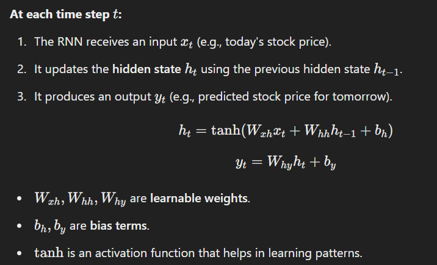

# RNNs

## Learning RNNs

### Deep Dive into RNNs
1. How RNNs process sequences.
2. Step-by-step breakdown of hidden states, weights, and updates.
3. Visualizing RNNs in action with a toy example.

RNNs process sequential data by maintaining a hidden state that carries information from previous steps. This makes them well-suited for tasks where past information is crucial (like predicting stock prices or detecting fraudulent transactions).

An RNN takes in a sequence of inputs and processes them one by one while maintaining a memory of previous steps.

